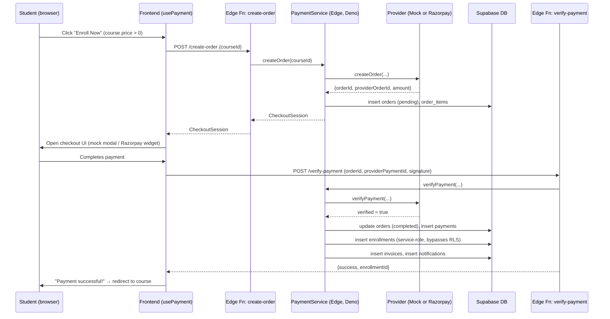
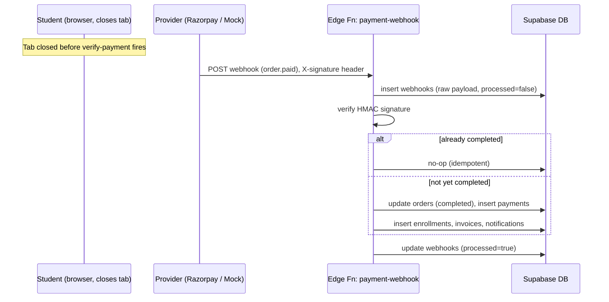
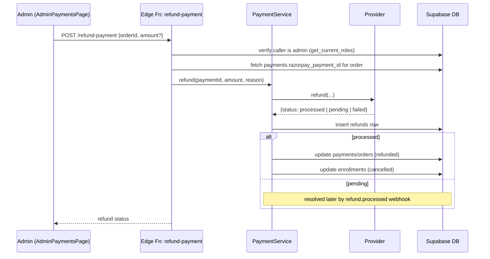

# SkillGuru — Payment Architecture

_Written 2026-07-24, before implementing `PaymentService`/`MockPaymentProvider`. This is a planning document — no application code is changed by this file. All "current state" claims below were verified live (schema reads, RLS policy reads, and reading every existing payment-related Edge Function's source) rather than assumed._

---

## 1. Current payment flow (as it exists today — broken)

The live code has a payment pipeline, but it is disconnected from the real schema at multiple points and is **not deployed**. Concretely:

- `src/services/payment.service.ts` (`razorpayService`) calls Edge Functions named `create-razorpay-order`, `verify-razorpay-payment`, `process-razorpay-refund`. **None of these exist.** The actual functions in `supabase/functions/` are named `create-order`, `verify-payment`, `payment-webhook`, `payment-status`, `refund-payment`.
- Per `list_edge_functions` (checked live): only `create-mentor`, `leads`, and `enroll-free` (added in the previous task) are actually **deployed**. `create-order`, `verify-payment`, `payment-webhook`, `payment-status`, `refund-payment` exist only as source in the repo — they cannot be invoked at all today, regardless of naming.
- Because the named calls fail, `razorpayService.createOrder()` and `.verifyAndComplete()` both fall through to a **client-side "dev fallback"**: it inserts an `orders`/`payments` row directly from the browser and, on the verify side, grants enrollment with **no real signature verification** — this is BUG-02 in `BUG_REPORT.md`, a real security hole (free/unauthorized course access) that predates this document and is **not fixed by this plan on its own** — it is fixed by finishing and deploying the new architecture below and deleting the fallback.
- Even the correctly-named source functions would fail at the database layer if deployed as-is, for reasons not previously fully catalogued:
  - `verify-payment` and `payment-webhook` both insert into **`student_enrollments`**, which does not exist (real table: `enrollments`, columns `student_id`/`course_id`/`status`, not `progress`/`certificate_issued`).
  - Both insert into **`invoices`** with `user_id`, `amount`, `status` columns — the real `invoices` table only has `order_id`, `invoice_number`, `pdf_url`. These inserts would fail outright.
  - Both insert into `notifications` with `user_id`/`message`/`type` — the real table expects `recipient_id`/`body`/`category`/`status` (BUG-03, previously documented).
  - `payment-status` and `refund-payment` both call an RPC named `current_user_roles`, which doesn't exist (the real, working RPC used everywhere else in the codebase is `get_current_roles`, confirmed via `pg_proc`).
  - `refund-payment`'s own code comments admit it doesn't have a real `razorpay_payment_id` to refund against and returns `"Refund processed successfully (mock)."` without calling Razorpay at all (BUG-05).
  - `create-order` and `verify-payment` are otherwise structurally reasonable (JWT-verified caller, service-role DB writes, HMAC signature check) — they are schema-broken, not architecturally broken.

**Net effect**: no payment path works today. Free-course enrollment was fixed separately (Phase 1.5, `enroll-free` function). Paid-course checkout has no working path — real or mock.

---

## 2. Future payment flow (target state)

```
Student clicks "Enroll Now" (course.price > 0)
        │
        ▼
useCheckout() ─── frontend hook, unchanged surface area
        │
        ▼
PaymentService.createOrder(courseId)  ← frontend NEVER talks to a provider directly
        │
        ▼
 [ provider selected by env var, resolved once, server + client agree via the same enum ]
        │
   ┌────┴─────┐
   ▼          ▼
MockPaymentProvider   RazorpayProvider
(local dev / CI /     (calls real Razorpay
 no credentials)       Orders/Payments API)
        │
        ▼
Edge Function: create-order  (service-role, writes `orders`+`order_items`)
        │
        ▼
Student completes checkout (mock modal, or real Razorpay Checkout.js)
        │
        ▼
Edge Function: verify-payment  (service-role, verifies signature/mock-token,
                                 writes `payments`, grants `enrollments`,
                                 writes `invoices`, notifies student)
        │
        ▼
Edge Function: payment-webhook (async confirmation path — real for Razorpay,
                                 simulated for Mock — idempotent against the
                                 same order, handles the case where the
                                 student closes the tab before verify-payment
                                 runs client-side)
```

Key architectural rule carried through every step: **the frontend only ever calls `PaymentService`.** It never imports a provider, never sees a provider-specific field name, and never branches on which provider is active. Provider selection happens once, server-side, from an environment variable.

---

## 3. Database tables

| Table | Role | Current schema issues |
|---|---|---|
| `orders` | One row per checkout attempt. `user_id`, `total_amount`, `currency`, `status` (free-text, not the `order_status` enum — see § 15), `razorpay_order_id`, `coupon_id`, `discount_amount`, `failure_reason`. | None blocking — usable as-is. |
| `order_items` | Line items per order (`order_id`, `course_id`, `price`). Supports multi-course checkout even though the current UI only ever buys one course at a time. | None blocking. |
| `payments` | One row per payment attempt against an order. `order_id`, `amount`, `provider`, `provider_id`, `razorpay_payment_id`, `razorpay_signature`, `status` (free-text, not the `payment_status` enum), `method`, `bank`, `card_last4`, `vpa`, `wallet`, `failure_code`, `failure_reason`. | Has a `provider` column already — this is the intended discriminator for Mock vs Razorpay. Not currently populated with real `razorpay_payment_id` before refund time (root cause of BUG-05). |
| `refunds` | `payment_id`, `order_id`, `amount`, `reason`, `status`, `razorpay_refund_id`, `initiated_by`, `processed_at`. | Fine as-is once `payments.razorpay_payment_id` is actually populated at verify time. |
| `payment_logs` | Free-form event/audit trail (`event`, `payload` jsonb, `order_id`, `payment_id`, `error`). RLS: `INSERT` restricted to `service_role` (fixed in Phase 0), `SELECT` admin-only. | Intended write target for every provider-side event (webhook received, signature failure, mock-simulated failure, etc.) — currently unused by any function. |
| `webhooks` | Raw inbound webhook log (`provider`, `event_type`, `payload` jsonb, `processed`, `processed_at`, `error`). RLS: `INSERT` restricted to `service_role`. | Currently unused — `payment-webhook` doesn't log to it before processing, so a webhook that fails mid-processing leaves no trace. New implementation should insert here first, process second. |
| `enrollments` | Source of truth for course access (`student_id`, `course_id`, `status` enum, `enrollment_source` enum, `granted_by`). RLS: only `admin` can `INSERT` directly (confirmed live, see Phase 1.5). | This is why every enrollment-granting path — `enroll-free` and the future `verify-payment` — must run with the **service-role key**, never as a direct client insert. |
| `invoices` | `order_id`, `invoice_number`, `pdf_url` only — no `user_id`/`amount`/`status`. | Existing draft functions write fields that don't exist here; new implementation must only write the 3 real columns and derive amount/user via the `order_id` join when rendering. |
| `certificates` | `enrollment_id`, `certificate_number`, `verification_code`, `certificate_file_id`, `issued_by`, `issued_at`, `qr_code_url`, `share_url`, `template_id`. RLS: `INSERT`/`UPDATE`/`DELETE` admin-only; `SELECT` is currently `true OR (...)` — effectively public-readable (worth a follow-up security note, out of scope for this document). | Not written by any payment function today — see § 8. |
| `courses` | `price` (numeric, nullable — null/0 means free). | Was silently dropped by the domain-model mapper until Phase 1.5; now fixed. |

---

## 4. Edge Functions

| Function | Status today | Target responsibility |
|---|---|---|
| `create-order` | Source exists, undeployed, schema-clean | Resolve active provider from env, delegate order creation to it, write `orders`/`order_items`, return a provider-agnostic `CheckoutSession` to the frontend. |
| `verify-payment` | Source exists, undeployed, schema-broken (`student_enrollments`, `invoices`, `notifications`) | Verify the provider's proof (HMAC signature for Razorpay, a signed mock token for Mock), write `payments`, grant `enrollments` (service-role), write a real `invoices` row, notify via the real `notifications` schema. Idempotent: repeat calls for an already-completed order are a no-op success. |
| `payment-webhook` | Source exists, undeployed, schema-broken, no dedup log | Log the raw payload to `webhooks` first (so nothing is silently lost), verify the provider's webhook signature, then apply the same idempotent state transition as `verify-payment` — this is the async safety net for the case where the student's browser never calls `verify-payment` (closed tab, network drop). |
| `payment-status` | Source exists, undeployed, calls nonexistent `current_user_roles` RPC | Let a student poll their own order's status; admin override via the real `get_current_roles` RPC. |
| `refund-payment` | Source exists, undeployed, mock-only despite its name, same RPC bug | Real implementation: look up `payments.razorpay_payment_id` (now actually populated), call the provider's refund method through `PaymentService`, write `refunds`, revoke the affected `enrollments` row(s). |
| `enroll-free` | **Deployed, live** (Phase 1.5) | Unchanged — stays the dedicated path for `price = 0/null` courses. Payment functions above only ever handle `price > 0`. |

All five payment functions must be rewritten against the real schema before being deployed for the first time — "redeploy" is the wrong mental model here since none of them have ever successfully run in production.

---

## 5. Order lifecycle

```
pending  ──────────────► completed
   │                          │
   │                          └────► refunded  (via refund-payment)
   └──────────────► cancelled  (student abandons checkout / mock "cancelled" simulation)
   └──────────────► failed     (provider declines / mock "failure" simulation, tracked via payments.status + orders.failure_reason)
```
- `pending`: row created by `create-order`, before the student completes checkout.
- `completed`: set by `verify-payment` (client-driven) or `payment-webhook` (async), whichever arrives first — the second arrival is a no-op due to idempotency.
- `failed` / `cancelled`: terminal, no enrollment granted, no retry without a new order.
- `refunded`: terminal, set only by `refund-payment`, only reachable from `completed`.

---

## 6. Enrollment lifecycle

```
(no row)
   │
   │  free course            paid course
   │  enroll-free()          verify-payment() / payment-webhook()
   ▼                              ▼
 active ──────────────────────────┘
   │
   ├──► completed   (100% lesson progress, existing recalculate_course_progress() trigger)
   ├──► expired     (time-limited access plans — not currently modeled anywhere; out of scope)
   └──► cancelled   (refund-payment revokes access)
```
`enrollment_source` distinguishes how the row was created (`purchase` for both free and paid enrollment today, `admin`/`manual`/`mentor`/`coupon`/`scholarship` for the other existing paths) — this is preserved, not changed, by the payment work.

---

## 7. Refund lifecycle

```
payments.status = 'completed'
        │
        │  admin initiates refund (full or partial amount)
        ▼
refunds row created, status = 'pending'
        │
        │  PaymentService.refund() → provider.refund()
        ▼
   ┌────┴────┐
   ▼         ▼
'processed'  'failed'
   │
   ├──► payments.status = 'refunded'
   ├──► orders.status = 'refunded'
   └──► affected enrollments.status = 'cancelled'
```
Mock provider simulates both outcomes (see § 9). Razorpay provider calls the real Refunds API and relies on `refund.processed`/`refund.failed` webhook events to move a refund out of `pending` if the synchronous API call doesn't return a terminal state immediately (Razorpay refunds are not always synchronous).

---

## 8. Certificate lifecycle

Not currently wired to anything — no function inserts into `certificates` today. Planned dependency chain (this document only, not implemented until the dedicated Certificates task, Phase 1.7):

```
enrollments.status → 'completed'  (trigger-driven, already exists)
        │
        ▼
 (future) on_enrollment_completed trigger or a scheduled job
        │
        ▼
 certificates row created: certificate_number + verification_code generated,
 issued_at = now(), issued_by = null (system-issued) or an admin's id (manual issue)
        │
        ▼
 certificate PDF rendered (out of scope for payment work) → certificate_file_id set
```
Payment work's only obligation here: make sure `verify-payment`/`payment-webhook` correctly flip `enrollments.status` to `active` (not `completed` — completion is progress-driven, not payment-driven) so the existing completion trigger has a valid row to act on later.

---

## 9. Payment abstraction

```ts
// src/services/payment/PaymentService.ts
interface PaymentProvider {
  createOrder(input: CreateOrderInput): Promise<Result<CheckoutSession>>;
  verifyPayment(input: VerifyPaymentInput): Promise<Result<PaymentVerificationResult>>;
  capturePayment(input: CapturePaymentInput): Promise<Result<CaptureResult>>;
  refund(input: RefundInput): Promise<Result<RefundResult>>;
}

class PaymentService {
  constructor(private provider: PaymentProvider) {}
  createOrder(...)      { return this.provider.createOrder(...); }
  verifyPayment(...)     { return this.provider.verifyPayment(...); }
  capturePayment(...)    { return this.provider.capturePayment(...); }
  refund(...)            { return this.provider.refund(...); }
}
```
This lives **inside the Edge Functions** (Deno-side), not in the frontend — the frontend already only calls `create-order`/`verify-payment`/etc. by HTTP, so the abstraction boundary that matters is provider-vs-`PaymentService`, one layer below where the frontend sits. The frontend's `razorpayService`/`usePayment.ts` will be renamed/refactored to a provider-agnostic `paymentService`/`usePayment.ts` that no longer has "Razorpay" anywhere in its name or types, but its public function signatures (`createOrder`, `verifyAndComplete`, `initiateRefund`) stay the same — this is the "no frontend changes when Razorpay becomes available" requirement.

Mock provider must simulate, as literal, selectable outcomes (driven by a `simulate` field the frontend passes through only in non-production builds, or by course-price conventions like `₹1` = force-failure, for QA without a UI toggle):
- **Success** — instant `completed` order + `enrollments` grant.
- **Failure** — `orders.status = 'failed'`, `payments.status = 'failed'`, with a realistic `failure_reason`.
- **Cancelled** — student "closes the modal": `orders.status = 'cancelled'`, no payment row.
- **Expired** — order created but never verified within a simulated TTL; a scheduled sweep (or lazy check-on-read) marks it `failed`/`expired`.
- **Refund** — full lifecycle per § 7, both `processed` and `failed` outcomes selectable.
- **Verification** — a mock HMAC-equivalent check using a shared secret (`MOCK_PAYMENT_SECRET`), so `verify-payment`'s signature-verification code path is exercised identically in Mock and Razorpay mode, not skipped.
- **Duplicate** — calling `verifyPayment` twice for the same order returns the same success result idempotently rather than double-granting enrollment or erroring.
- **Pending** — order sits in `pending` until explicitly resolved, exercising `payment-status` polling.

---

## 10. Provider architecture

```
                 ┌───────────────────────────┐
  Frontend  ───► │       PaymentService       │  (Edge Function, Deno)
 (unaware of     │  createOrder / verify /    │
  which          │  capture / refund          │
  provider is    └─────────────┬─────────────┘
  active)                      │
                    resolved once from
                    PAYMENT_PROVIDER env var
                                │
                 ┌──────────────┴──────────────┐
                 ▼                             ▼
      MockPaymentProvider              RazorpayProvider
      (no external calls,              (real Razorpay Orders/
       deterministic simulated          Payments/Refunds API,
       outcomes, used in dev/CI/        HMAC signature verify,
       until Razorpay creds exist)      real webhook handling)
```
Both implement the exact same `PaymentProvider` interface from § 9. Switching providers is a **single environment variable change** (`PAYMENT_PROVIDER=mock|razorpay`) plus, for Razorpay, supplying the three real secrets in § 11 — no code path branches on provider identity anywhere outside the one factory function that picks which class to instantiate.

---

## 11. Required environment variables

| Variable | Used by | Notes |
|---|---|---|
| `PAYMENT_PROVIDER` | All payment Edge Functions | `mock` (default, until Razorpay creds exist) or `razorpay`. Single switch. |
| `RAZORPAY_KEY_ID` | `create-order`, frontend Checkout.js widget | **TODO — not set yet.** Public-ish (embedded client-side by Razorpay's own SDK), but still stored as a secret since it's provider-specific config. |
| `RAZORPAY_KEY_SECRET` | `create-order`, `verify-payment`, `refund-payment` | **TODO — not set yet.** Never sent to the frontend. |
| `RAZORPAY_WEBHOOK_SECRET` | `payment-webhook` | **TODO — not set yet.** Separate from `KEY_SECRET` — Razorpay issues a distinct secret per configured webhook endpoint. |
| `MOCK_PAYMENT_SECRET` | Mock provider only | Generated once, any random string — stands in for `RAZORPAY_KEY_SECRET` so the signature-verification code path is real in both modes. Safe to commit a dev default; must differ per environment in principle. |
| `SUPABASE_URL` / `SUPABASE_SERVICE_ROLE_KEY` / `SUPABASE_ANON_KEY` | All functions | Already configured (existing Edge Function convention, confirmed in `create-mentor`/`create-order`). |

---

## 12. Required webhooks

| Webhook | Source | Purpose |
|---|---|---|
| `order.paid` / `payment.captured` | Razorpay (real) or Mock's simulated webhook dispatcher | Async confirmation — completes the order even if the student's browser never calls `verify-payment` directly. |
| `payment.failed` | Razorpay / Mock | Marks the order/payment as failed without waiting for the frontend. |
| `refund.processed` / `refund.failed` | Razorpay / Mock | Razorpay refunds are not always synchronous — this is how a `pending` refund resolves. |

All three must be logged to `webhooks` (raw payload, before any processing) and verified via HMAC signature (`RAZORPAY_WEBHOOK_SECRET` for real, `MOCK_PAYMENT_SECRET` for Mock) before any DB state changes — mirroring `payment-webhook`'s existing (correct) signature-check structure, just fixed to write to real tables.

---

## 13. Future production migration steps (Mock → Razorpay)

1. Obtain real Razorpay account + API keys (business-side prerequisite, not engineering).
2. Set `RAZORPAY_KEY_ID`, `RAZORPAY_KEY_SECRET`, `RAZORPAY_WEBHOOK_SECRET` as Supabase Edge Function secrets.
3. Register the production webhook URL (`.../functions/v1/payment-webhook`) in the Razorpay dashboard, selecting the events in § 12.
4. Flip `PAYMENT_PROVIDER` from `mock` to `razorpay` — no code deploy required if this is read at request time from `Deno.env`.
5. Run one real ₹1 (or lowest-denomination) end-to-end transaction in Razorpay's live mode before announcing the switch, verifying: order creation, checkout modal, signature verification, enrollment grant, invoice row, notification, and a full refund.
6. Monitor `payment_logs`/`webhooks` tables for the first real transactions before fully trusting the async webhook path (i.e. keep both `verify-payment` and `payment-webhook` active — they're intentionally redundant/idempotent).
7. Only after step 5 passes: remove/disable the client-side dev-fallback code in the current `payment.service.ts` (BUG-02) — it must not exist in any code path reachable from a production build, mock or otherwise.

No frontend code changes are needed for this migration — that's the entire point of the abstraction in § 9/§10.

---

## 14. Sequence diagrams

### 14.1 Successful paid checkout



### 14.2 Async webhook confirms a payment the browser missed



### 14.3 Refund



---

## 15. Rollback strategy

- **Provider rollback**: `PAYMENT_PROVIDER=razorpay → mock` is a single env var flip, reversible instantly, no data migration — this is the primary safety net if Razorpay integration misbehaves in production.
- **Function rollback**: every Edge Function deploy in this plan is a new, previously-undeployed function (or a from-scratch rewrite of dead source) — there is no "previous working version" to protect, so rollback means redeploying the prior source (kept in git history) or, if the new function is actively causing harm, disabling it in the Supabase dashboard while the dev-fallback path (temporarily, and only in non-production) covers the gap.
- **Schema rollback**: this plan introduces **no destructive migrations**. All fixes are either additive (nothing) or corrections to what Edge Functions write, not to table shapes — `orders`/`payments`/`refunds`/`invoices`/`enrollments`/`certificates` schemas are unchanged. If a future step needs a real migration (e.g., populating `razorpay_payment_id` reliably, or promoting `orders.status`/`payments.status` from free-text to their existing-but-unused enums), it will be proposed separately as its own HIGH-risk item, not bundled here.
- **Webhook rollback**: if a malformed/misconfigured webhook starts writing bad data, the fix is to disable the webhook in the Razorpay dashboard (or stop calling the Mock dispatcher) — `payment-webhook` logs to `webhooks` before mutating anything, so a bad batch can be identified and the affected `orders`/`payments` rows manually corrected via SQL, referencing the logged raw payloads.
- **Enrollment-grant rollback**: because grants happen through a service-role Edge Function (not a broadened RLS policy), the blast radius of a bug here is contained to that function's logic — RLS on `enrollments` stays admin-only for direct writes throughout, so a compromised frontend cannot self-grant enrollment no matter what goes wrong in the payment code.

---

_This document will be updated once implementation begins if any design decision changes during build — per project policy, documentation is kept in sync with behavior, not written once and forgotten._

---

## 16. Database Schema (full detail)

All of the following was read live from the production database (`pg_indexes`, `pg_constraint`, `information_schema.triggers`, `pg_policies`) on 2026-07-24, not assumed from migration files.

### `orders`
- **Purpose**: one row per checkout attempt (order-level, can bundle multiple courses via `order_items`, though the current UI only ever buys one).
- **Columns**: `id` (uuid, PK), `user_id` (uuid, FK), `total_amount` (numeric), `currency` (text, default likely `INR`), `status` (**free text, no CHECK constraint** — see § 3 for the state machine this document imposes by convention, not by DB enforcement), `razorpay_order_id` (text, unique, nullable), `coupon_id` (uuid, FK, nullable), `discount_amount` (numeric, nullable), `failure_reason` (text, nullable), `notes` (text, nullable), `created_at`, `updated_at`.
- **Relationships**: `user_id → profiles(id) ON DELETE CASCADE`; `coupon_id → coupon_codes(id) ON DELETE SET NULL`. Referenced by `order_items.order_id`, `payments.order_id`, `refunds.order_id`, `payment_logs.order_id` — all `ON DELETE CASCADE`.
- **Indexes**: `orders_pkey` (id), `idx_orders_user_id` (user_id), `orders_razorpay_order_id_key` (unique, razorpay_order_id), `idx_orders_razorpay` (partial, `WHERE razorpay_order_id IS NOT NULL`).
- **RLS**: `SELECT`/`INSERT` — admin or `user_id = auth.uid()` (a student can create/see only their own orders). `UPDATE`/`DELETE` — admin only. This is why every state transition after creation (`pending → completed/failed/...`) must run through a service-role Edge Function, not a client-side update.
- **Triggers**: `set_updated_at` (BEFORE UPDATE).
- **Note**: the `razorpay_order_id` unique constraint means the Mock provider must generate genuinely unique fake order IDs (not a fixed placeholder) even outside real Razorpay traffic.

### `order_items`
- **Purpose**: line items per order.
- **Columns**: `id` (uuid, PK), `order_id` (uuid, FK), `course_id` (uuid, FK), `price` (numeric, snapshot of the course's price *at time of purchase* — deliberately not a live join to `courses.price`, so historical orders stay accurate if a course's price later changes), `created_at`.
- **Relationships**: `order_id → orders(id) ON DELETE CASCADE`; `course_id → courses(id) ON DELETE RESTRICT` (a course with existing order history cannot be hard-deleted — relevant if course deletion is ever added).
- **Indexes**: `order_items_pkey`, `idx_order_items_order_id`, `idx_order_items_course_id`.
- **RLS**: `SELECT`/`INSERT` — admin or via the parent `orders.user_id = auth.uid()`. `UPDATE`/`DELETE` — admin only.
- **Triggers**: none.

### `payments`
- **Purpose**: one row per payment attempt against an order (an order can have more than one payment row if a first attempt fails and the student retries).
- **Columns**: `id` (uuid, PK), `order_id` (uuid, FK), `amount` (numeric), `provider` (text — the Mock-vs-Razorpay discriminator), `provider_id` (text, generic provider-side reference), `razorpay_payment_id` (text, unique, nullable), `razorpay_signature` (text, nullable), `status` (**free text, no CHECK constraint**), `method`/`bank`/`card_last4`/`vpa`/`wallet` (nullable, payment-method metadata Razorpay returns), `failure_code`/`failure_reason` (nullable), `created_at`, `updated_at`.
- **Relationships**: `order_id → orders(id) ON DELETE CASCADE`. Referenced by `refunds.payment_id`, `payment_logs.payment_id` (both CASCADE).
- **Indexes**: `payments_pkey`, `payments_razorpay_payment_id_key` (unique), `idx_payments_razorpay` (partial, non-null).
- **RLS**: `SELECT` — admin or via the parent order's `user_id = auth.uid()`. `INSERT`/`UPDATE`/`DELETE` — **admin only** (i.e., service-role only in practice, since no student-facing role ever needs to write here directly).
- **Triggers**: **none found** — despite having an `updated_at` column, there is no `set_updated_at` trigger on `payments` (a real gap; every write path must set `updated_at` manually until this is added, which is out of scope for this document since it would be a schema change).

### `refunds`
- **Purpose**: one row per refund request/outcome against a payment.
- **Columns**: `id` (uuid, PK), `payment_id` (uuid, FK), `order_id` (uuid, FK), `amount` (numeric), `reason` (text), `status` (text, **CHECK-constrained** to `pending | processing | processed | failed | cancelled` — the only payment-related status column with real DB enforcement), `razorpay_refund_id` (text, unique, nullable), `initiated_by` (uuid, FK to `profiles`), `processed_at` (timestamp, nullable), `notes` (text, nullable), `created_at`, `updated_at`.
- **Relationships**: `payment_id → payments(id) ON DELETE CASCADE`; `order_id → orders(id) ON DELETE CASCADE`; `initiated_by → profiles(id) ON DELETE SET NULL`.
- **Indexes**: `refunds_pkey`, `refunds_razorpay_refund_id_key` (unique), `idx_refunds_payment`, `idx_refunds_order`, `idx_refunds_status`.
- **RLS**: `SELECT` — admin or via the parent order's `user_id = auth.uid()`. `INSERT`/`UPDATE`/`DELETE` — admin only.
- **Triggers**: `set_updated_at` (BEFORE UPDATE).

### `payment_logs`
- **Purpose**: append-only diagnostic/audit trail for payment-related events (distinct from `webhooks` — this is for *any* event a function wants to record, not just inbound webhook payloads).
- **Columns**: `id` (uuid, PK), `order_id` (uuid, FK, nullable), `payment_id` (uuid, FK, nullable), `event` (text), `payload` (jsonb, nullable), `error` (text, nullable), `created_at`.
- **Relationships**: `order_id → orders(id) ON DELETE CASCADE`; `payment_id → payments(id) ON DELETE CASCADE`.
- **Indexes**: `payment_logs_pkey`, `idx_payment_logs_order`, `idx_payment_logs_created` (DESC, for recent-first admin views).
- **RLS**: `INSERT` — `service_role` only (`with_check: true`, restricted at the role level, fixed in Phase 0). `SELECT` — admin only. No `UPDATE`/`DELETE` policy at all (append-only by RLS design — even an admin cannot edit/delete a log row through the API).
- **Triggers**: none.

### `webhooks`
- **Purpose**: raw inbound webhook payload log, provider-agnostic.
- **Columns**: `id` (uuid, PK), `provider` (text), `event_type` (text), `payload` (jsonb, **not nullable** — every webhook must be logged with its full body before processing), `processed` (boolean, default false), `processed_at` (timestamp, nullable), `error` (text, nullable), `created_at`.
- **Relationships**: **none** — no FK to `orders`/`payments`. The link back to a specific order/payment lives only inside `payload` (e.g. Razorpay's `notes.supabase_order_id`), which is why `payment-webhook` must parse the payload to find the order, rather than joining.
- **Indexes**: `webhooks_pkey`, `idx_webhooks_processed`, `idx_webhooks_created` (DESC).
- **RLS**: `INSERT` — `service_role` only. `SELECT` — admin only. Same append-only shape as `payment_logs`.
- **Triggers**: none.

### `enrollments` (repeated here for completeness, full detail beyond § 3's summary)
- **Columns**: `id` (uuid, PK), `student_id` (uuid, FK), `course_id` (uuid, FK), `status` (enum `enrollment_status`: `active | completed | expired | cancelled`), `enrollment_source` (enum `enrollment_source`: `manual | purchase | coupon | scholarship | admin | mentor`), `granted_by` (uuid, FK, nullable), `enrolled_at`, `completed_at` (nullable), `created_at`, `updated_at`.
- **Relationships**: `student_id → profiles(id) ON DELETE CASCADE`; `course_id → courses(id) ON DELETE CASCADE`; `granted_by → profiles(id) ON DELETE SET NULL`. Referenced by `certificates.enrollment_id ON DELETE CASCADE`.
- **Indexes**: `enrollments_pkey`, **`enr_student_course_unique` (UNIQUE on `student_id, course_id`)** — a student cannot have two enrollment rows for the same course; both `enroll-free` and the future `verify-payment` must treat a unique-violation here as "already enrolled," not a hard error. `idx_enrollments_student_id`, `idx_enrollments_course_id`, `idx_enrollments_status`.
- **RLS**: `INSERT` — admin only (see Phase 1.5 finding — no student self-insert path exists; this is why `enroll-free` and the payment functions must use the service-role key). `SELECT` — admin, the course's mentor, or the enrolled student. `UPDATE` — admin or the enrolled student (their own row only — e.g. for progress-adjacent fields, not status). `DELETE` — admin only.
- **Triggers**: `set_updated_at` (BEFORE UPDATE); also (not payment-specific, documented previously) `update_course_progress`/`update_course_progress_delete` live on `lesson_progress`, not `enrollments` itself.
- **Note**: there is **no direct FK from `payments` or `orders` to `enrollments`** — the link is implicit (order → order_items → course_id, orders → user_id, matched against enrollments.student_id/course_id). Payment code must create the enrollment row itself; nothing does it automatically via a DB trigger.

### `certificates`
- **Purpose**: issued-certificate records, one per completed enrollment.
- **Columns**: `id` (uuid, PK), `enrollment_id` (uuid, FK, **unique** — at most one certificate per enrollment), `certificate_number` (text, unique), `verification_code` (text, unique), `certificate_file_id` (uuid, FK to `files`, nullable), `issued_by` (uuid, FK to `profiles`, nullable — null means system-issued), `issued_at`, `qr_code_url` (nullable), `share_url` (nullable), `template_id` (uuid, FK to `certificate_templates`, nullable), `created_at`, `updated_at`.
- **Relationships**: `enrollment_id → enrollments(id) ON DELETE CASCADE`; `issued_by → profiles(id) ON DELETE SET NULL`; `template_id → certificate_templates(id) ON DELETE SET NULL`; `certificate_file_id → files(id) ON DELETE SET NULL`.
- **Indexes**: `certificates_pkey`, `certificates_enrollment_id_key` (unique), `certificates_certificate_number_key` (unique), `certificates_verification_code_key` (unique), plus non-unique `idx_certificates_number`/`idx_certificates_code` (redundant with the unique indexes above, but harmless).
- **RLS**: `INSERT`/`UPDATE`/`DELETE` — admin only. `SELECT` — currently `true OR (...)`, which Postgres short-circuits to **unconditionally public-readable** — anyone, including anonymous/unauthenticated requests, can read every row in `certificates` today. This predates the payment work and is **flagged, not fixed, here** (fixing it is a Certificates-task concern, Phase 1.7, since certificates are meant to be publicly verifiable by design via `verification_code` — but "verifiable by code" and "fully enumerable via SELECT *" are different things worth revisiting there).
- **Triggers**: `set_updated_at` (BEFORE UPDATE).

### `invoices`
- **Purpose**: invoice number + optional PDF pointer per order.
- **Columns**: `id` (uuid, PK), `order_id` (uuid, FK), `invoice_number` (text, unique), `pdf_url` (text, nullable), `created_at`. **No `user_id`, `amount`, or `status` column** — these must be derived by joining `orders` when rendering an invoice, not stored redundantly (the existing draft functions incorrectly assume these columns exist).
- **Relationships**: `order_id → orders(id) ON DELETE CASCADE`.
- **Indexes**: `invoices_pkey`, `invoices_invoice_number_key` (unique).
- **RLS**: not separately queried in this pass — inherits the general pattern from other order-adjacent tables (admin or owning student via the `orders` join); to be confirmed at implementation time rather than assumed.
- **Triggers**: none.

### `courses` (payment-relevant columns only)
- **`price`** (numeric, nullable — null or `0` means free, per the convention established in Phase 1.5). No CHECK constraint preventing negative prices — worth a light validation in `PaymentService.createOrder` (reject `price < 0` defensively) even though nothing in the current admin course-creation UI can produce one today.

---

## 17. Event Flow

The full event chain for a single successful **paid** enrollment, naming every step exactly as it will appear in `payment_logs.event`:

```
order.create_requested
        ↓
order.created                     (orders row inserted, status=pending)
        ↓
provider.order_created             (Mock or Razorpay confirms order/session on their side)
        ↓
checkout.opened                    (frontend renders the payment UI)
        ↓
checkout.completed                 (student submits payment details)
        ↓
provider.verify_requested
        ↓
provider.signature_verified        (or provider.signature_invalid → verification failed path)
        ↓
payment.recorded                   (payments row inserted, status=completed)
        ↓
order.completed                    (orders row updated, status=completed)
        ↓
enrollment.created                 (enrollments row inserted via service-role, status=active)
        ↓
invoice.generated                  (invoices row inserted)
        ↓
notification.sent                  ("Payment successful" notification via the real notifications schema)
        ↓
certificate.eligibility_checked     (no-op at enrollment time — this just confirms the enrollment
                                     row now exists for the *future* completion trigger to act on;
                                     no certificate is issued here, see § 8)
```

Every arrow above is a `payment_logs` insert in the real implementation (`event` = the exact label shown), so a stuck order can be diagnosed by reading its log chain rather than guessing from `orders.status` alone. Failure branches insert `provider.signature_invalid`, `payment.failed`, or `order.failed` instead of continuing down the chain, and stop there — no `enrollment.created` follows a failure branch, ever.

The async webhook path (§ 14.2) emits the same event names, just triggered by `payment-webhook` instead of `verify-payment` — this is intentional, so the log reads identically regardless of which path actually completed the order (the idempotency check in § 6 is what prevents the *second* arrival from re-emitting `enrollment.created` a second time).

---

## 18. State Machine

### Order
```
pending ──► completed ──► refunded
   │
   ├──► failed
   ├──► cancelled
   └──► expired      (no CHECK constraint enforces this in the DB today — enforced only by
                       application logic in PaymentService / a scheduled sweep; see § 1's note
                       that orders.status is free text, not the existing-but-unused order_status enum)
```
Terminal states: `refunded`, `failed`, `cancelled`, `expired`. Only `completed` can transition to `refunded`. No state can transition back to `pending`.

### Payment
```
created ──► authorized ──► captured ──► refunded
   │             │
   └─────────────┴──► failed
```
- `created`: row inserted immediately when the provider confirms an order (mirrors Razorpay's own payment lifecycle terms, adopted here even for Mock so the vocabulary is provider-agnostic).
- `authorized`: provider has approved the payment method but not yet captured funds (Razorpay supports auth-then-capture; Mock simulates this as an intermediate state so `capturePayment()` in the `PaymentProvider` interface, § 9, has a real reason to exist rather than being a no-op).
- `captured`: funds captured — this is the DB's existing `completed` value in `payments.status` (naming kept as `completed` in the actual column to match the pre-existing convention already used by `orders.status`; `captured` here names the *concept*, not a literal new string value, to avoid a two-vocabulary mismatch between this doc and the code).
- `failed`: terminal from `created` or `authorized`.
- `refunded`: terminal from `captured` only, driven by the refund state machine below.

### Refund (DB-enforced via CHECK constraint — the most concrete of the three)
```
pending ──► processing ──► processed
   │             │
   │             └──► failed
   └──► cancelled   (admin withdraws the refund request before the provider processes it)
```
This is the only one of the three state machines with a real Postgres `CHECK` constraint (`refunds_status_check`) — `pending | processing | processed | failed | cancelled` are the only five legal values; anything else is rejected at the database level regardless of application-layer bugs.

### Enrollment
```
(no row) ──► active ──► completed
                │
                ├──► expired    (not currently produced by any code path — modeled for
                │                future time-limited access plans, see § 6 of the original doc)
                └──► cancelled  (refund-payment revokes access)
```
Enforced by the `enrollment_status` enum at the column type level (`active | completed | expired | cancelled`) — unlike `orders`/`payments`, this one **is** DB-enforced, since it's declared as an actual Postgres enum type, not `text`.

---

## 19. Mock Provider Specification

Every outcome below is selectable by the caller (via a `simulate` field passed through `createOrder`/`verifyPayment`, ignored/rejected outside non-production builds) so each can be exercised on demand in tests and QA, not just encountered by chance:

| Outcome | Triggered by | Resulting state |
|---|---|---|
| **Success** | default / `simulate: "success"` | `order.completed`, `payment: captured`, `enrollment: active`, invoice + notification emitted. |
| **Failure** | `simulate: "failure"` | `order.failed`, `payment: failed` with a realistic `failure_reason` (e.g. `"card_declined"`), no enrollment. |
| **Cancelled** | `simulate: "cancelled"` | Student "closes the modal" before submitting: `order.cancelled`, no `payments` row at all (mirrors Razorpay's own behavior — a dismissed checkout never reaches the payment-creation step). |
| **Expired** | `simulate: "expired"`, or an order left `pending` past a configurable TTL (`MOCK_ORDER_TTL_SECONDS`, default 900) | `order.expired` (via a lazy check on next read, or a scheduled sweep) — never reachable again, student must start a new checkout. |
| **Duplicate** | Calling `verifyPayment` twice for the same already-`completed` order | Second call returns the **same success result** idempotently (§ 6) — no second `payments`/`enrollments` row, no error surfaced to the caller. |
| **Timeout** | `simulate: "timeout"` | The Mock provider's `createOrder`/`verifyPayment` call artificially delays past a configured threshold before returning a `failed`/`error` result — exercises the frontend's own request-timeout handling and any retry logic, distinct from **Expired** (which is about the *order* aging out, not a single API call hanging). |
| **Verification Failed** | `simulate: "verification_failed"`, or a client submitting a signature that doesn't match `MOCK_PAYMENT_SECRET` | `provider.signature_invalid` logged, `order` stays `pending` (not `failed` — an invalid signature might mean the client is buggy/malicious, not that the payment itself failed; the student can still legitimately complete the real flow), HTTP 400 returned. |
| **Refund Success** | `simulate: "refund_success"` (default when `refund()` is called without a simulate flag) | `refunds.status` → `processed`, `payments.status` → `refunded`, `orders.status` → `refunded`, affected `enrollments.status` → `cancelled`. |
| **Refund Failure** | `simulate: "refund_failure"` | `refunds.status` → `failed`, nothing else changes — the student keeps access, matching real-world behavior where a failed refund shouldn't silently revoke a paid course. |

All nine outcomes write to `payment_logs` with the same `event` vocabulary from § 17, so a test asserting "the Mock provider behaved like Razorpay would" can inspect the log chain rather than provider-specific internals.

---

## 20. API Contracts

All five endpoints share the existing project response envelope (already used by `create-mentor`, confirmed in that function's source): `{ success, message, data, errors, meta: { requestId, timestamp, version } }`.

### `createOrder`
- **Request** (`POST /functions/v1/create-order`, `Authorization: Bearer <student JWT>`):
  ```json
  { "courseId": "uuid" }
  ```
- **Response 201**:
  ```json
  {
    "success": true, "message": "Order created",
    "data": {
      "orderId": "uuid",            // our orders.id
      "providerOrderId": "string",  // razorpay_order_id or mock equivalent
      "amount": 1999900,             // in paise
      "currency": "INR",
      "provider": "mock" | "razorpay",
      "keyId": "string | null"       // only present for razorpay, used by Checkout.js
    }
  }
  ```
- **Errors**: 400 (course not found / course is free — use `enroll-free` instead / price ≤ 0), 401 (unauthenticated).

### `verifyPayment`
- **Request** (`POST /functions/v1/verify-payment`):
  ```json
  {
    "orderId": "uuid",
    "providerPaymentId": "string",
    "providerOrderId": "string",
    "signature": "string"   // mock-HMAC or real Razorpay signature, same field name either way
  }
  ```
- **Response 200**:
  ```json
  { "success": true, "message": "Payment verified", "data": { "enrollmentId": "uuid", "orderId": "uuid" } }
  ```
- **Errors**: 400 (missing params / invalid signature), 403 (order doesn't belong to caller), 404 (order not found), 409 (order already in a terminal non-completed state, e.g. `refunded`/`cancelled` — cannot verify a dead order).
- **Idempotent**: calling twice for an already-`completed` order returns 200 with the same `enrollmentId`, not an error.

### `refundPayment`
- **Request** (`POST /functions/v1/refund-payment`, admin-only caller):
  ```json
  { "orderId": "uuid", "amount": 199900, "reason": "string" }  // amount optional → full refund
  ```
- **Response 200**:
  ```json
  { "success": true, "message": "Refund processed", "data": { "refundId": "uuid", "status": "pending" | "processed" | "failed" } }
  ```
- **Errors**: 400 (order not `completed` / amount exceeds paid total), 403 (caller is not admin), 404 (order or its payment not found — including the specific case where `payments.razorpay_payment_id` was never populated, a currently-real gap called out in § 1).

### `paymentStatus`
- **Request** (`GET /functions/v1/payment-status?order_id=uuid`, any authenticated user, self-scoped):
  ```
  GET /functions/v1/payment-status?order_id=uuid
  ```
- **Response 200**:
  ```json
  { "success": true, "message": "OK", "data": { "orderId": "uuid", "status": "pending" | "completed" | "failed" | "cancelled" | "refunded" | "expired" } }
  ```
- **Errors**: 403 (order belongs to someone else and caller is not admin — fixed to use the real `get_current_roles` RPC, not the nonexistent `current_user_roles`), 404.

### `webhook` (`payment-webhook`)
- **Request** (`POST /functions/v1/payment-webhook`, no user JWT — authenticated instead via provider signature header):
  - Headers: `X-Razorpay-Signature` (or `X-Mock-Signature` in Mock mode) computed over the raw request body.
  - Body: raw provider payload (Razorpay's native webhook shape, or Mock's equivalent synthetic shape using the same field names it dispatches internally).
- **Response 200** (always, once the payload is durably logged to `webhooks` — providers retry on non-2xx, so this function must not 5xx merely because *processing* failed after logging succeeded):
  ```json
  { "success": true, "message": "Received" }
  ```
- **Errors**: 401 only (missing/invalid signature — this is the one case where the payload is rejected before even being logged, since an unverified payload could be forged).

---

## 21. Security

- **JWT**: every student/admin-facing function (`create-order`, `verify-payment`, `payment-status`, `refund-payment`) validates the caller's JWT via `callerClient.auth.getUser()` against the `Authorization` header — the exact pattern already proven in `create-mentor`/`create-order`/`enroll-free`. `payment-webhook` is the one exception (see below) since it's never called with a user JWT at all.
- **Webhook verification**: `payment-webhook` authenticates via **HMAC signature over the raw request body**, not a JWT — `X-Razorpay-Signature` checked against `RAZORPAY_WEBHOOK_SECRET` (real) or `X-Mock-Signature` against `MOCK_PAYMENT_SECRET` (Mock), using the same `crypto.createHmac('sha256', ...)` pattern already present (correctly) in the existing draft `payment-webhook`/`verify-payment` source. The raw body must be read via `request.text()` **before** JSON-parsing, so the signature is computed over the exact bytes the provider signed — parsing to JSON first and re-serializing would produce a different byte sequence and fail verification unpredictably.
- **Replay attack prevention**: two layers — (1) each webhook payload is logged to `webhooks` with its raw body; a payload whose signature was already seen (same signature value, or same provider event ID if Razorpay includes one) is logged but not reprocessed — `processed=true` rows are never re-applied. (2) `verify-payment`'s idempotency check (below) means even a successfully-replayed request can't grant a second enrollment or double-charge state.
- **Idempotency**: enforced structurally, not just by convention — the `enr_student_course_unique` constraint on `enrollments` makes a duplicate enrollment insert fail at the DB level as a safety net even if application logic has a bug; the primary idempotency check is still explicit ("if `orders.status = 'completed'` already, short-circuit and return the existing result") so the *response* is a clean success, not a caught unique-violation error. The `razorpay_payment_id`/`razorpay_order_id`/`razorpay_refund_id` unique constraints provide the same DB-level backstop for `payments`/`refunds`.
- **Rate limiting**: not currently implemented at the Edge Function layer for any function in this project (confirmed — no rate-limiting code in `create-mentor`/`create-order`/etc.). For payment functions specifically, recommend Supabase's platform-level rate limiting (configurable per-project) as the first line of defense, plus a lightweight application-layer check in `create-order` (e.g. reject a new order if the same `user_id` created one for the same `course_id` in the last N seconds) to blunt accidental double-submit from a slow/double-clicked "Enroll Now" button — this is a UX safeguard more than a security one, and is flagged here as a recommendation for implementation time, not a blocking requirement of this document.
- **Audit logging**: every state-changing event in § 17 writes to `payment_logs` (payment-specific) in addition to the project's general `audit_logs` table for the higher-level actions that already log there elsewhere (e.g. admin-initiated refunds should also produce an `audit_logs` row with `actor_id` = the admin, mirroring the existing `create-mentor` convention of logging administrative actions there) — `payment_logs` is the detailed/technical trail, `audit_logs` is the "who did what" trail; both matter for different audiences (engineering debugging vs. compliance/admin review).

---

## 22. Testing Strategy

- **Unit**: `PaymentProvider` implementations (`MockPaymentProvider`, and any pure-logic helpers like signature verification or amount-in-paise conversion) get direct unit tests with `vitest`, following the project's existing test setup (`src/services/__tests__/`). Every outcome in § 19 gets at least one dedicated test case.
- **Integration**: each Edge Function tested against a real (local or a disposable branch) Supabase instance — verifying actual RLS behavior (e.g. a non-admin caller cannot invoke `refund-payment` successfully), not just mocked Supabase client calls. This is the same standard already recommended (but not yet built) in `TECHNICAL_DEBT.md` § 9 for the service layer generally — payments is the highest-priority domain to start with, per that same doc's own stated priority order.
- **Playwright**: end-to-end "browse → enroll (Mock success) → see course unlocked" and "browse → enroll (Mock failure) → see error, course still locked" flows, run against the Mock provider (never against real Razorpay in CI). Extends the existing Playwright setup already used elsewhere in the project for smoke/regression tests.
- **Mock Provider** (as its own testing surface, distinct from using it to test the rest of the app): a dedicated test suite that asserts the Mock provider's own behavior matches the *documented* Razorpay contract shape (same field names, same error codes) — this is what makes "no frontend changes when Razorpay becomes available" a testable claim rather than an assumption.
- **Regression**: the standard four-command suite already established throughout this engagement (`tsc --noEmit`, `eslint .`, `vitest run`, `npm run build`) runs after every change in the implementation phase, exactly as it has for every prior task in this session.

---

## 23. Deployment Strategy

- **Development**: `PAYMENT_PROVIDER=mock` always. No real secrets needed or read — `RAZORPAY_*` env vars can be entirely absent locally; the provider factory must not throw if they're unset while `PAYMENT_PROVIDER=mock`.
- **Staging** (if/when a staging Supabase project exists — none is currently configured for this project, only a single production project per `list_projects`): `PAYMENT_PROVIDER=mock` by default, with the option to flip to `razorpay` against Razorpay's **test mode** keys (not live) to validate the real integration path end-to-end without moving real money — this is "Test Razorpay" in § 24's migration path.
- **Production**: starts on `PAYMENT_PROVIDER=mock` (since no live Razorpay credentials exist yet, per your original instruction not to block development on this) and flips to `razorpay` only after the steps in § 13/§ 24 are complete. The flip is a Supabase Edge Function secret update, not a code deploy.

---

## 24. Migration Strategy (Mock → Test Razorpay → Live Razorpay)

```
Mock
  │  (current state; all development and QA happens here)
  ▼
Test Razorpay
  │  Set RAZORPAY_KEY_ID/KEY_SECRET/WEBHOOK_SECRET to Razorpay TEST-mode values
  │  (free, no real money moves, but exercises the actual Razorpay API/webhook
  │   shapes instead of Mock's simulated ones)
  │  Run the full § 22 test suite again with PAYMENT_PROVIDER=razorpay against test keys
  │  Manually complete a handful of test-mode checkouts using Razorpay's published
  │  test card/UPI numbers, covering success, failure, and refund
  ▼
Live Razorpay
     Swap TEST-mode keys for LIVE-mode keys (same three env vars, different values —
     Razorpay cleanly separates test/live key pairs by design)
     Re-register the webhook URL under live mode (test and live webhooks are
     configured separately in Razorpay's dashboard)
     Run one real low-value end-to-end transaction (§ 13, step 5) before
     announcing the switch
```
The critical property this migration path depends on: **Test Razorpay and Live Razorpay are the same `RazorpayProvider` code, different keys** — there is no separate "test provider" class to maintain. Only Mock is architecturally distinct.

---

## 25. Rollback Strategy — Razorpay failure in production

If `PAYMENT_PROVIDER=razorpay` starts misbehaving in production (Razorpay outage, a bug surfaces only under real traffic, webhook delivery failures, etc.):

1. **Immediate action**: flip the `PAYMENT_PROVIDER` Edge Function secret back to `mock`. No code deploy, no database change — this takes effect on the *next* invocation of any payment function, typically within seconds (Supabase Edge Function secrets are read via `Deno.env.get()` at request time, not baked in at deploy time).
2. **What this does and doesn't fix**: new checkouts immediately start using Mock again — meaning **real payments cannot be taken while rolled back**. This is a deliberate trade-off: it is always safer to temporarily stop taking real payments than to keep taking them through a broken/uncertain path. Students already mid-checkout against Razorpay when the flip happens may see an inconsistent state (order created against Razorpay, verified against Mock) — `verify-payment`/`payment-webhook` should treat a `provider` mismatch between an order's stored value and the currently-active provider as a hard error requiring manual admin review, not a silent pass-through, so this edge case surfaces rather than corrupting data.
3. **Data already written before rollback is untouched** — orders/payments/refunds created while Razorpay was active keep their real `razorpay_order_id`/`razorpay_payment_id`/`razorpay_refund_id` values; nothing needs to be backfilled or cleaned up purely because of the provider flip.
4. **Communicate and monitor**: this is a business-visible event (checkout is effectively "free-course-only" until re-enabled) — pairs with the existing project convention of flagging anything customer-visible, even though the flip itself is a config change an engineer can execute solo without further approval once already authorized to operate the Razorpay integration.
5. **Re-enabling**: only after the root cause is understood and fixed (or Razorpay's own outage resolves) — flip `PAYMENT_PROVIDER` back to `razorpay`. No different from the original Test→Live migration in § 24; this isn't a special "recovery mode," just the same switch used in reverse.

This is the same mechanism as § 13/§ 15's provider rollback, restated here with the specific "production incident" framing you asked for — the two sections are intentionally consistent, not competing strategies.

